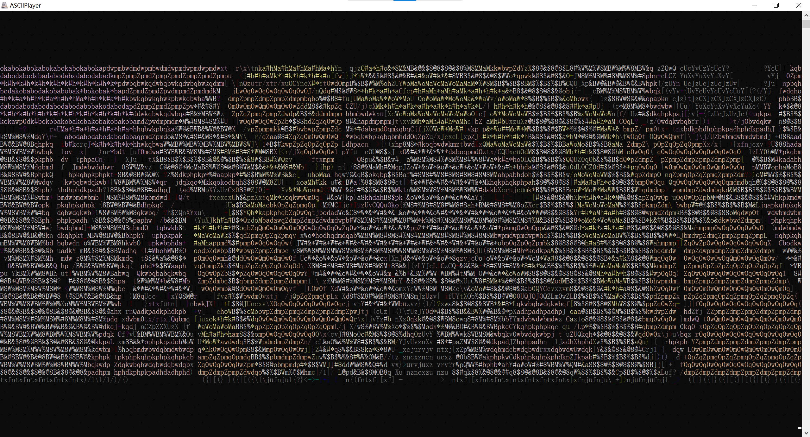

# ASCIIPlayer

<div align="center">



[English](#english) | [中文](#中文)

</div>

---

## English

### What it is

A small C# console program. It pipes video frames through ffmpeg, turns each frame into colored ASCII text, and redraws the terminal at a fixed 10 FPS.

Three ways to use it:

- `ASCIIPlayer.exe video.mp4` — play in the current console.
- `ASCIIPlayer.exe video.mp4 -r out.mp4` — render to a video file.
- `ASCIIPlayer.exe video.mp4 -r out.mp4 --play` — render and watch in the terminal at the same time.

For plain playback the audio is extracted to a temp wav and played with `SoundPlayer`. In render mode the audio comes from the source via ffmpeg and is muxed into the output file; terminal playback in that mode is silent.

### Requirements

- Windows only. It uses `kernel32.dll` and `user32.dll` P/Invoke for console mode, window centering and size queries, plus GDI+ and `SoundPlayer`. It won't run on Linux/macOS.
- .NET Framework / .NET Windows Desktop, needs `System.Drawing`.
- `ffmpeg.exe`, embedded as a resource.

### Before you build

1. Get a Windows ffmpeg build (static, GPL or LGPL), take `ffmpeg.exe`.
2. Put it in the project at `Resources\ffmpeg.exe`.
3. Set its build action to **Embedded Resource**.
4. The resource name must resolve to `ASCIIPlayer.Resources.ffmpeg.exe`. If your root namespace or folder differs, either rename the resource, or edit the string in `Program.cs`. Pick one, not both.

At runtime the exe is extracted to `Path.GetTempPath()` and reused if it's already there.

### Usage

```
ASCIIPlayer.exe <video> [options]

  -r, --render <path>   render ASCII animation to a video file (mp4/mkv)
  -n, --size <WxH>      output resolution, e.g. 1920x1080
                        defaults to the current console window size
  --play                (with -r) play in terminal while rendering
  -h, --help            show help
```

`-n` only does something when `-r` is also given. Without it, playback just follows the console window.

Examples:

```
ASCIIPlayer.exe video.mp4
ASCIIPlayer.exe video.mp4 -r out.mp4
ASCIIPlayer.exe video.mp4 -r out.mp4 -n 1920x1080
ASCIIPlayer.exe video.mp4 -r out.mkv -n 2560x1440
ASCIIPlayer.exe video.mp4 -r out.mp4 --play
```

### How it works

1. ffmpeg decodes the source and writes raw `rgb24` frames at 640x360 to stdout.
2. Each frame is sampled down to the console's character grid. Two vertical pixels are averaged into one character cell, since a character is roughly twice as tall as it is wide.
3. Luma is `(r*30 + g*59 + b*11) / 100`, then gamma 0.85 and an 8x8 Bayer dither, so the character steps don't band too hard.
4. Luma picks a character from a density ramp (space up to `@`). RGB is mapped to an xterm-256 color and written as `\x1b[38;5;Nm`.
5. Frames are drawn with `\x1b[H` (cursor home) at 10 FPS. The visible console area is read with `GetConsoleScreenBufferInfo` instead of `Console.WindowWidth`, which is more reliable in some states.

Render mode runs the same loop but draws into a GDI+ `Bitmap` (Consolas, 8x16 per cell), copies it as `bgr24` and pipes it into a second ffmpeg process encoding `libx264 -crf 20` + `aac 192k`.

### External dependencies

This project pulls in no NuGet packages. The only extra dependency is `ffmpeg.exe`.

**ffmpeg.exe**

- Purpose: decode video, output raw RGB frames, extract audio, encode the output video.
- Distribution: bundled as an embedded resource, extracted to `Path.GetTempPath()` at runtime.
- Source: any Windows static build (Gyan.dev, BtbN, etc.).
- License: ffmpeg is not part of this project. Its license is GPL or LGPL depending on the build you pick. Check and comply with the one you use. If you distribute this program with a GPL build, the whole program must be distributed under the GPL as well.

---

## 中文

### 这是什么

一个 C# 控制台小工具。视频帧经过 ffmpeg 出来之后，每帧转成带颜色的 ASCII 文本，固定 10 FPS 重画终端。

三种用法：

- `ASCIIPlayer.exe video.mp4`：直接在终端里播放。
- `ASCIIPlayer.exe video.mp4 -r out.mp4`：渲染成视频文件。
- `ASCIIPlayer.exe video.mp4 -r out.mp4 --play`：渲染的同时在终端里播放。

纯播放时音频会先抽成临时 wav，用 `SoundPlayer` 播。渲染模式下音频由 ffmpeg 从原视频取，混进输出文件；这时候终端播放是没有声音的。

### 环境

- 仅限 Windows。代码用了 `kernel32.dll` 和 `user32.dll` 的 P/Invoke 来开控制台 VT、居中窗口、读窗口尺寸，加上 GDI+ 和 `SoundPlayer`，在 Linux/macOS 上跑不起来。
- .NET Framework / .NET Windows Desktop，需要 `System.Drawing`。
- `ffmpeg.exe`，作为嵌入资源。

### 编译前要做的事

1. 下载 Windows 版 ffmpeg（静态构建，GPL 或 LGPL 都行），取出 `ffmpeg.exe`。
2. 放到项目的 `Resources\ffmpeg.exe`。
3. 生成操作设为 **嵌入的资源**（Embedded Resource）。
4. 资源名要能解析成 `ASCIIPlayer.Resources.ffmpeg.exe`。根命名空间或文件夹名不一样的话，要么改资源名，要么改 `Program.cs` 里的字符串，二选一。

运行时会把 exe 解到 `Path.GetTempPath()`，已经存在就直接用。

### 用法

```
ASCIIPlayer.exe <视频文件> [选项]

  -r, --render <路径>   把 ASCII 动画编码成视频（mp4 / mkv）
  -n, --size <WxH>      指定输出视频分辨率，例如 1920x1080
                        不指定就用当前窗口对应的分辨率
  --play                配合 -r 使用，编码的同时也在终端播放
  -h, --help            显示帮助
```

`-n` 只在同时给了 `-r` 的时候有用。不给的话，播放就跟着控制台窗口走。

示例：

```
ASCIIPlayer.exe video.mp4
ASCIIPlayer.exe video.mp4 -r out.mp4
ASCIIPlayer.exe video.mp4 -r out.mp4 -n 1920x1080
ASCIIPlayer.exe video.mp4 -r out.mkv -n 2560x1440
ASCIIPlayer.exe video.mp4 -r out.mp4 --play
```

### 大概原理

1. ffmpeg 解码原视频，按 640x360 输出 `rgb24` 原始帧到 stdout。
2. 每帧按终端字符网格采样。纵向两个像素取平均合成一个字符格，因为字符高度大约是宽度的两倍。
3. 亮度按 `(r*30 + g*59 + b*11) / 100` 算，再过一个 0.85 的 gamma 和 8x8 Bayer 抖动，让字符过渡不那么硬。
4. 亮度选字符（一张由疏到密的 ramp，从空格到 `@`），RGB 映射到 xterm-256 色，用 `\x1b[38;5;Nm` 输出。
5. 每帧用 `\x1b[H` 回到左上角重画，固定 10 FPS。控制台可见区域用 `GetConsoleScreenBufferInfo` 读，比 `Console.WindowWidth` 在某些状态下靠谱些。

渲染模式是同一条循环，只是把画面画进 GDI+ 的 `Bitmap`（Consolas，8x16 一格），转成 `bgr24` 塞给另一个 ffmpeg 进程，用 `libx264 -crf 20` 和 `aac 192k` 编码。

### 外部依赖

本项目没有引入任何 NuGet 包，唯一的额外依赖是 `ffmpeg.exe`。

**ffmpeg.exe**

- 用途：解码视频、输出原始 RGB 帧、提取音频、编码输出视频。
- 分发：作为嵌入资源打包进程序，运行时释放到 `Path.GetTempPath()`。
- 来源：任选一个 Windows 静态构建（Gyan.dev、BtbN 等）。
- 许可：ffmpeg 不是本项目的一部分，其许可是 GPL 或 LGPL，取决于你选用的构建。请自行确认并遵守对应许可。若你以 GPL 构建分发本程序，整个程序也需要按 GPL 分发。
